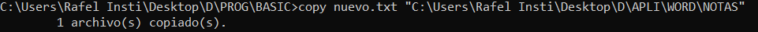

# EJERCICIOS MSDOS Rafel Llull
1.- Crea la siguiente estructura de carpetas:

2.- Sitúate en la carpeta TABLAS

3.- Vuelve a la carpeta raíz

4.- Muestra el contenido de la carpeta PROG

5.- Borra la carpeta PASCAL

6.- Sitúate en la carpeta VARIOS y desde allí crea una nueva carpeta dentro de WORD llamado
PRACT

7.- Sitúate en PRACT y desde allí muestra el contenido de la carpeta EXCEL

8.- Desde TABLAS muestra el listado de archivos y carpetas de la carpeta raíz

9.- Sitúate en la carpeta APLI y desde allí crea una subcarpeta llamada AGENDA dentro de
VARIOS

10.- Borra la carpeta EXCEL

11.- Desde la carpeta raíz, crea en ella una subcarpeta llamada NUEVO

12.- Desde PRACT muestra el contenido de WORD

EJERCICIO 2 Nombre:
Indica en cada caso las órdenes utilizadas:

1.- Utilizando el editor de textos de MS-DOS, crea un archivo de texto denominado EJER.TXT,
con el siguiente contenido, y almacénalo dentro de la carpeta TEXTOS (dentro de la estructura
del ejercicio anterior):
“La información dentro de los discos se almacena en forma de archivos. Un archivo
o fichero es un conjunto de datos que MS-DOS almacena en un disco y cuyo
control interno es realizado por el sistema operativo, aunque desde el punto de
vista lógico el control es del usuario”

2.- Copia el archivo EJER.TXT en AGENDA

3.- Borra el archivo almacenado en la carpeta TEXTOS

4.- Añade el siguiente párrafo al archivo EJER.TXT:
“Cada archivo tiene un nombre y una extensión que los distingue del resto de archivos”

5.- Copia el archivo EJER.TXT en la carpeta BASIC

6.- Cambia el nombre del archivo almacenado en AGENDA por FICHERO.TXT

7.- Mueve el archivo FICHERO.TXT a la carpeta BASIC

8.- Abre el archivo EJER.TXT y borra la primera frase; almacena el nuevo archivo con el
nombre NUEVO.TXT dentro de la carpeta BASIC

9.- Copia el archivo NUEVO.TXT en la carpeta NOTAS

10.- ¿Cuántos archivos hay en la carpeta BASIC? ¿Y en NOTAS?

3 en basic y 1 en notas

EJERCICIO 3 Nombre:
Indica en cada caso las órdenes utilizadas:
1.- Borra la carpeta ACCESS y en su lugar crea una nueva carpeta llamada ASTRO

2.- Crea la siguiente estructura de subcarpetas dentro de la carpeta ASTRO

3.- Sitúate en la carpeta CIENCIA y desde allí muestra el listado de archivos y subcarpetas de la
carpeta HISTORIA

4.- Utilizando el editor de MS-DOS crea el siguiente archivo de texto y guárdalo con el nombre
TYCHO.TXT dentro de la carpeta DATOS1
“La importancia de Tycho Brahe (1546-1601) es debida a sus trabajos
observacionales, que registraron posiciones notables del Sol, la Luna y los
planetas”

5.- Utilizando de nuevo el editor de textos de MS-DOS crea el siguiente archivo de texto, y
guárdalo con el nombre KEPLER.TXT dentro de la carpeta DATOS2

“ La información acumulada facilitó a Johannes Kepler (1571-1630) el
descubrimiento de las leyes que gobiernan el movimiento de los planetas”

6.- Copia los archivos TYCHO.TXT y KEPLER.TXT en la carpeta CIENCIA

7.- Cambia de lugar los archivos almacenados en DATOS1 y DATOS2 de forma que TYCHO.TXT
quede guardado dentro DATOS2 y KEPLER.TXT en DATOS1

8.- Crea un nuevo archivo formado por la unión de los dos anteriores (sin volver a escribir el
texto) y guárdalo dentro de la carpeta HISTORIA con el nombre TOTAL.TXT

9.- Abre el archivo KEPLER.TXT almacenado en la carpeta CIENCIA y añade el siguiente texto:
“Kepler aplicó sus teorías a los satélites de Júpiter, descubiertos por
Galileo a través de un pequeño telescopio, cuya introducción en la
observación astronómica constituye uno de los hitos de la astronomía.”

10.- Cambia el nombre del archivo anterior por el de GALILEO.TXT

ASTRO

HISTORIA CIENCIA
DATOS1 DATOS2 ASTRO1 ASTRO2

EJERCICIO 4 Nombre:
Indica en cada caso las órdenes utilizadas:

1.- Crea en la carpeta raíz de la unidad A: una carpeta denominada TECINFO

2.- Crea dentro de TECINFO el siguiente archivo de texto y llámalo HARD.TXT
“El HARDWARE está constituido por los elementos físicos del ordenador.
Consta esencialmente de componentes electrónicos que proporcionan el
soporte necesario para la interpretación y ejecución de las operaciones
elementales que realiza el ordenador”

3.- Crea dentro de TECINFO el siguiente archivo de texto y llámalo SOFT.TXT
“El SOFTWARE es el conjunto de elementos lógicos necesarios para que el
ordenador realice las funciones que se le encomiendan. Está formado por
los programas, es decir, por un conjunto ordenado de instrucciones,
comprensibles por la máquina, que permiten desarrollar tareas concretas”

4.- Mueve el contenido de TECINFO a la carpeta APLI del disquete A utilizado para realizar los
ejercicios anteriores

5.- Crea un nuevo archivo formado por la unión de HARD.TXT y SOFT.TXT, sin volver a escribir
el texto, y guárdalo en la carpeta AGENDA con el nombre ORDER.TXT

6.- Elimina la carpeta TECINFO

7.- Copia a la vez los archivos HARD.TXT y SOFT.TXT en la carpeta VARIOS

8.- Cambia la extensión de los archivos contenidos en AGENDA por .TYP

9.- Cambia la primera letra del nombre de todos los archivos del directorio APLI que empiecen
por la letra C y tengan extensión DOC de forma que empiecen con la letra S

10.- Copia los archivos contenidos en la carpeta APLI que tengan extensión DOC en la carpeta
AGENDA
